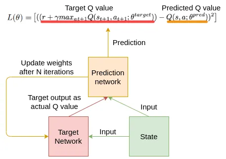
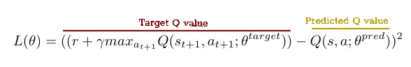

# Reinforcement Learning
## I. Phân tích
### 1. Dạng bài toán RL
Bài toán này thuộc dạng mô hình học tăng cường giải quyết `puzzle`, tương tự các bài toán như `Rubik’s Cube` hoặc `Sliding Puzzle`.
- Trạng thái (State): Biểu diễn bằng bảng hiện tại sau mỗi lần thực hiện phép biến đổi.
    - Mỗi trạng thái là một bảng (grid) với các ô có giá trị từ 0 đến 3, biểu diễn trạng thái hiện tại của bảng.
    - Kích thước của bảng có thể thay đổi tùy bài toán, nhưng trong khoảng $32 \times 32$ đến $256 \times 256$.
    - Đầu vào cho mạng nơ-ron sẽ là ma trận biểu diễn các ô của bảng hiện tại.
- Hành động (Action): Một hành động bao gồm việc chọn một khuôn, tọa độ đặt khuôn, và hướng di chuyển (top, bottom, left, right).
    - Hành động bao gồm:
        - Chọn một khuôn (fixed die hoặc general die).
        - Chọn tọa độ $(x, y)$ để đặt khuôn trên bảng.
        - Chọn hướng dịch chuyển d $∈$ {top, bottom, left, right}.
    - Số lượng hành động có thể rất lớn, vì có nhiều cách chọn tọa độ và hướng dịch chuyển. Để giảm số lượng hành động, bạn có thể chọn một số khuôn và tọa độ nhất định để thử nghiệm, hoặc dùng kỹ thuật giảm số chiều (dimensionality reduction).

- Phần thưởng (Reward): Dựa trên sự khác biệt giữa bảng kết quả và bảng đích sau mỗi hành động.
    - Phần thưởng cao nếu sau hành động đó trạng thái bảng gần hơn với bảng đích.
    - Phần thưởng thấp hoặc phạt nếu hành động không làm tiến triển bảng đến trạng thái đích.
    - Phần thưởng lý tưởng là số lượng ô khác biệt giữa bảng hiện tại và bảng đích, mục tiêu là giảm số ô khác biệt này về $0$.

### 2. Các thuật toán phù hợp
- **Deep Q-Learning (DQN)**: Dùng mô hình DQN để học hàm giá trị hành động $𝑄(𝑠,𝑎)$. DQN phù hợp vì không gian trạng thái rất lớn (kích thước bảng tối đa là $(256×256)$.
- Double DQN: Cải tiến DQN để giảm thiểu vấn đề đánh giá quá cao giá trị $𝑄$.
- Dueling DQN: Sử dụng mô hình dueling network để tách biệt giữa phần giá trị trạng thái và phần lợi thế của hành động.
- Multi-Agent RL (nếu bài toán phức tạp hơn): Có thể coi mỗi loại khuôn là một tác nhân (agent) và sử dụng phương pháp học đa tác nhân.

### 3. Chiến lược khám phá
- Sử dụng chiến lược `ε-greedy` để khám phá không gian trạng thái.
- Khi đã đủ dữ liệu, giảm dần $ε$ để tập trung khai thác các hành động có giá trị cao.

### 4. Kỹ thuật huấn luyện
- **Replay Buffer**: Lưu lại các trải nghiệm để huấn luyện DQN, tránh hiện tượng tương quan mạnh giữa các mẫu dữ liệu.
- **Target Network**: Sử dụng mạng mục tiêu để ổn định quá trình huấn luyện.

### 5. Mô hình kiến trúc
Sử dụng mô hình `CNN` để trích xuất đặc trưng từ bảng trạng thái $𝑠$, vì bảng là một ma trận 2D.
Kết hợp các đặc trưng từ `CNN` với các thông tin về hành động để dự đoán giá trị $𝑄(𝑠,𝑎)$.

### 6. Quy trình Huấn luyện
- Bước 1: Đặt trạng thái khởi đầu là bảng nguồn.
- Bước 2: Sử dụng `epsilon-greedy` để chọn hành động (chọn khuôn, tọa độ và hướng dịch chuyển).
- Bước 3: Thực hiện hành động và quan sát trạng thái mới cùng với phần thưởng.
- Bước 4: Lưu lại trải nghiệm (trạng thái, hành động, phần thưởng, trạng thái kế tiếp) vào `Replay Buffer`.
- Bước 5: Lấy một batch từ `Replay Buffer` và huấn luyện mô hình `DQN` bằng cách giảm thiểu hàm mất mát giữa `Q-value` dự đoán và giá trị mục tiêu.
- Bước 6: Lặp lại các bước trên đến khi đạt được bảng đích hoặc sau một số lượng bước cố định.

### 7. Công cụ
- **Pytorch**: Xây dựng mạng nơ-ron ước tính `Q-value` cho mỗi hành động.
- **Gym**: Tạo môi trường tùy chỉnh cho bảng và khuôn theo mô tả bài toán.

Hướng tiếp theo: Biến thể `Double DQN` hoặc `Dueling DQN`
## II. Triển khai

### Kiến trúc tổng quan:

### Thiết kế mô hình:
- Dữ liệu đầu vào: Đầu vào là một tensor có kích thước (batch_size, 2, 32, 32):
    - $2$ là số lượng kênh, gồm bảng `start` và bảng `goal`.
    - $32 \times 32$ là kích thước của bảng.

### Mô hình CNN:
- Convolution Layer 1: $16$ filters, kernel size = $3 \times 3$, stride = $1$.
- Convolution Layer 2: $32$ filters, kernel size = $3 \times 3$, stride = $1$.
- Flatten: Chuyển từ tensor sang vector.
- Fully Connected Layer: Đưa qua một mạng `MLP` với một lớp ẩn kích thước $128$.
- Output Layer: Số lượng đầu ra bằng số lượng hành động có thể thực hiện, tùy vào bài toán cụ thể (ví dụ: có thể là $4$ hướng di chuyển).

### Hàm mất mát và tối ưu hóa:
- Sử dụng hàm mất mát `Bellman`.

- $r+γmax_{a_{t+1}}Q(s_{t+1},a_{t+1};θ^{target})$ là giá trị mục tiêu (target)
- $r$ là phần thưởng nhận được sau khi thực hiện hành động
- $𝛾$ là yếu tố chiết khấu
- $𝜃$ là tham số của mạng `Q` cũ

Tối ưu hóa dựa trên giá trị `Q` được tính từ mô hình.

# Tham khảo
1. Karunakaran, D., Worrall, S. and Nebot, E., 2020. Efficient statistical validation with edge cases to evaluate Highly Automated Vehicles. arXiv preprint arXiv:2003.01886.